<!-- ==========================================
     PRONOY BISWAS — GitHub Profile README
     Premium Dark Theme | 2026 Edition
     Built with pure SVG + SMIL animations
     ========================================== -->

<!--
  ╔══════════════════════════════════════════╗
  ║     HERO SVG BANNER (GitHub Adaptive)   ║
  ╚══════════════════════════════════════════╝
  Two premium SVG banners — dark & light — are
  located in /assets/dark.svg and /assets/light.svg
  GitHub automatically serves the correct one based
  on the viewer's theme via the picture element below.
-->

<div align="center">

<!-- ✨ Premium Hero Banner — Automatically switches dark/light -->
<picture>
  <source media="(prefers-color-scheme: dark)"  srcset="assets/dark_v4.svg"/>
  <source media="(prefers-color-scheme: light)" srcset="assets/light_v4.svg"/>
  
</picture>

<!-- Animated Typing SVG -->
<a href="https://git.io/typing-svg">
  
</a>

<br/><br/>

<!-- Visitor Counter & Social Badges -->

&nbsp;
<a href="https://github.com/pronoy1510?tab=followers">
  
</a>
&nbsp;
<a href="https://github.com/pronoy1510?tab=repositories">
  
</a>

<br/><br/>

<!-- Social Connect Badges -->
<a href="https://github.com/pronoy1510">
  
</a>
&nbsp;
<a href="https://www.linkedin.com/in/pronoy-biswas-61216a366/">
  
</a>
&nbsp;
<a href="#">
  
</a>
&nbsp;
<a href="mailto:#">
  
</a>

</div>

<br/>

---

<!-- ABOUT ME SECTION -->

<div align="center">

## 🧠 About Me

</div>

```python
class PronoyBiswas:
    def __init__(self):
        self.name       = "Pronoy Biswas"
        self.role       = "Electronics & Communication Engineering Student"
        self.tagline    = "Building intelligent hardware and software solutions."
        self.languages  = ["C", "C++", "Python", "Java", "JavaScript", "TypeScript"]
        self.interests  = [
            "Embedded Systems",  "Internet of Things",
            "Artificial Intelligence",  "Machine Learning",
            "Computer Vision",  "Cloud Computing",
            "Backend Development",  "Frontend Development",
            "Problem Solving",  "Open Source"
        ]
        self.currently_learning = ["STM32", "RTOS", "Edge AI", "System Design"]
        self.fun_fact   = "I believe the best products live at the intersection of hardware and software."

    def greet(self):
        return (
            "Hey there! I'm Pronoy — an ECE student who loves blending "
            "electronics with software to craft intelligent, real-world systems. "
            "From designing embedded firmware and IoT pipelines to building "
            "AI-powered applications and full-stack web products, I chase ideas "
            "that make hardware think and software feel alive. "
            "I'm continuously learning, experimenting, and contributing to the "
            "open-source community. Let's build something amazing together!"
        )

pronoy = PronoyBiswas()
print(pronoy.greet())
```

<br/>

<div align="center">

| Emoji | Key | Value |
|:---:|:---|:---|
| 🔭 | Currently | Exploring STM32, RTOS & Edge AI |
| 🌱 | Learning | Advanced Embedded Systems & System Design |
| 💡 | Passionate | Hardware-Software Integration & AI/ML |
| 🎯 | 2026 Goal | Build real embedded products & secure top internship |
| ⚡ | Fun Fact | I bridge the gap between silicon and intelligence |

</div>

<br/>

---

<!-- TECH STACK SECTION -->

<div align="center">

## ⚡ Tech Stack & Tools

</div>

<details open>
<summary><b>🖥️ Programming Languages</b></summary>
<br/>
<div align="center">


</div>
</details>

<details open>
<summary><b>🔌 Embedded Systems & Hardware</b></summary>
<br/>
<div align="center">


</div>
</details>

<details open>
<summary><b>🤖 AI / Machine Learning</b></summary>
<br/>
<div align="center">


</div>
</details>

<details open>
<summary><b>🌐 Web Development</b></summary>
<br/>
<div align="center">


</div>
</details>

<details open>
<summary><b>🗄️ Databases</b></summary>
<br/>
<div align="center">


</div>
</details>

<details open>
<summary><b>☁️ Cloud, DevOps & Tools</b></summary>
<br/>
<div align="center">


</div>
</details>

<br/>

---

<!-- GITHUB ANALYTICS SECTION -->

<div align="center">

## 📊 GitHub Analytics


&nbsp;&nbsp;


<br/><br/>


<br/><br/>


<br/><br/>


<br/>


&nbsp;

&nbsp;


</div>

<br/>

---

<!-- GITHUB TROPHIES -->

<div align="center">

## 🏆 GitHub Trophies


</div>

<br/>

---

<!-- FEATURED PROJECTS SECTION -->

<div align="center">

## 🚀 Featured Projects

</div>

<table>
<tr>
<td width="50%" valign="top">

### 🎧 Adaptive Noise Cancellation
> Intelligent real-time noise suppression system combining DSP algorithms with embedded processing.

**Tech Stack:**


**Features:**
- Real-time adaptive filtering (LMS/NLMS)
- Low-latency DSP on bare-metal MCU
- >20dB noise reduction performance
- Configurable filter coefficients via UART


</td>
<td width="50%" valign="top">

### 🌐 Smart IoT Dashboard
> Full-stack IoT monitoring platform with real-time sensor visualization and remote control.

**Tech Stack:**


**Features:**
- MQTT-based real-time data streaming
- Interactive charts & historical analytics
- Configurable alerts & notifications
- JWT-authenticated REST API


</td>
</tr>
<tr>
<td width="50%" valign="top">

### 🔬 Embedded Sensor System
> Multi-sensor data acquisition with SPI/I2C bus management and RTOS task scheduling.

**Tech Stack:**


**Features:**
- Modular driver library (SPI/I2C/UART)
- FreeRTOS task scheduling & queues
- SD card data logging with timestamps
- Temperature, humidity, pressure, IMU fusion


</td>
<td width="50%" valign="top">

### 👁️ AI Vision Project
> Real-time computer vision with object detection and classification on edge devices.

**Tech Stack:**


**Features:**
- YOLOv8-based real-time object detection
- TFLite model optimization for edge deployment
- Live webcam + video file inference
- mAP tracking & confusion matrix visualization


</td>
</tr>
<tr>
<td width="50%" valign="top">

### 🌟 Portfolio Website
> Modern, responsive developer portfolio showcasing projects, skills, and contact info.

**Tech Stack:**


**Features:**
- Dark glassmorphism UI with smooth animations
- Fully responsive across all devices
- 95+ Lighthouse performance score
- Integrated contact form with email notifications


</td>
<td width="50%" valign="top">

### 🛠️ Full Stack Project
> End-to-end web app with authentication, CRUD operations, and cloud deployment.

**Tech Stack:**


**Features:**
- JWT + OAuth2 authentication system
- Real-time dashboard with WebSockets
- Dockerized for consistent deployment
- CI/CD pipeline via GitHub Actions + AWS


</td>
</tr>
</table>

<br/>

---

<!-- CURRENT LEARNING & GOALS -->

<div align="center">

## 📚 Currently Learning


</div>

<br/>

<div align="center">

## 🎯 2026 Goals

</div>

```
┌─────────────────────────────────────────────────────────────────┐
│                      🚀  2026 ROADMAP                           │
├─────────────────────────────────────────────────────────────────┤
│  🔲  Build and ship real embedded hardware products             │
│  🔲  Contribute meaningfully to Open Source projects            │
│  🔲  Publish research-grade embedded / AI project               │
│  🔲  Master advanced AI: LLMs, Diffusion, Edge Inference        │
│  🔲  Design and deploy production-grade IoT devices             │
│  🔲  Land a top-tier engineering internship                     │
└─────────────────────────────────────────────────────────────────┘
```

<br/>

---

<!-- CODING ACTIVITY -->

<div align="center">

## ⏱️ Coding Activity

<!--
  WakaTime Setup Instructions:
  1. Create a free account at https://wakatime.com
  2. Install the WakaTime plugin for VS Code / your IDE
  3. Add WAKATIME_API_KEY to your GitHub repository secrets
  4. Set up the waka-readme GitHub Action: https://github.com/athul/waka-readme
  5. Uncomment the block below once configured
-->

<!--START_SECTION:waka-->
```text
WakaTime stats will appear here once configured.
See: https://github.com/athul/waka-readme
```
<!--END_SECTION:waka-->

</div>

<br/>

---

<!-- MOTIVATIONAL QUOTE -->

<div align="center">

## 💬 Developer Philosophy

<br/>


<br/><br/>

> *"The best way to predict the future is to engineer it —*
> *one line of code, one circuit at a time."*
> — **Pronoy Biswas**

</div>

<br/>

---

<!-- CONNECT SECTION -->

<div align="center">

## 🌐 Let's Connect

<br/>

<a href="https://github.com/pronoy1510">
  
</a>
&nbsp;&nbsp;
<a href="https://www.linkedin.com/in/pronoy-biswas-61216a366/">
  
</a>
&nbsp;&nbsp;
<a href="#">
  
</a>
&nbsp;&nbsp;
<a href="mailto:#">
  
</a>
&nbsp;&nbsp;
<a href="#">
  
</a>

<br/><br/>

> 💡 *Open to collaborations on Embedded Systems, IoT, AI/ML, and Full Stack projects.*
> *Feel free to reach out — I'd love to connect and build together!*

</div>

<br/>

---

<!-- FOOTER WAVE -->


<div align="center">

<sub>
  ⭐ <b>Star repositories you find interesting</b> — it motivates open-source creators! &nbsp;|&nbsp;
  Made with ❤️ by <a href="https://github.com/pronoy1510">Pronoy Biswas</a>
</sub>

</div>
